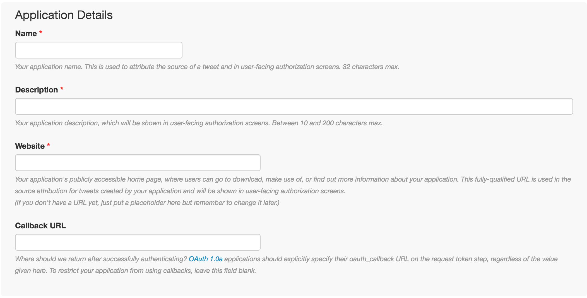
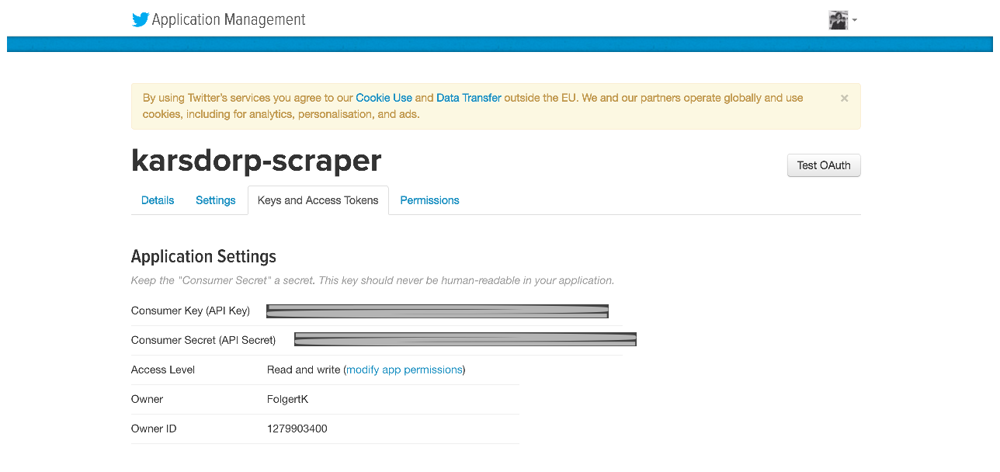
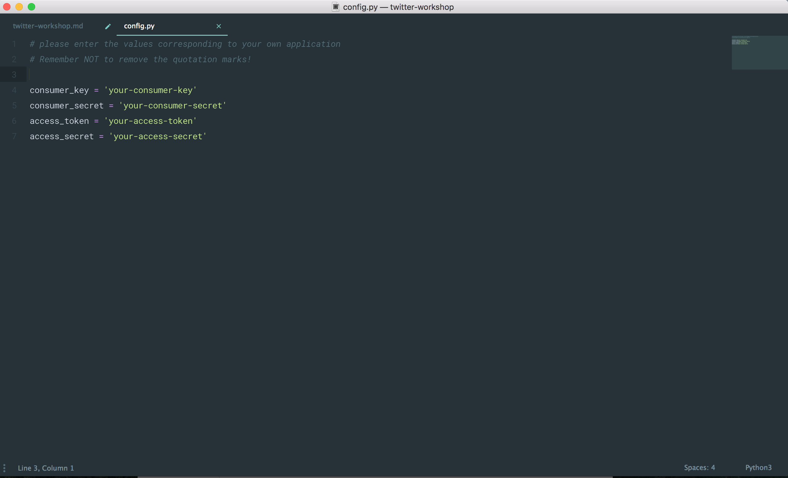
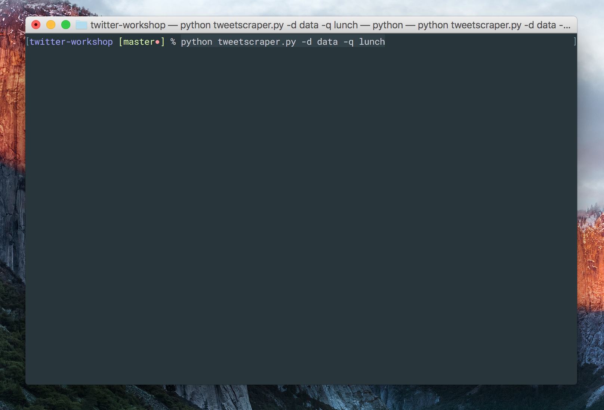

# Scraping Twitter with Python

Folgert Karsdorp

---

## Installation instructions

In this section, I will guide through the necessary steps to set up your computer for the course.

### Download course materials

This workshop consists of a number of Python scripts and a so-called "notebook". These materials should be downloaded by clicking on the "download ZIP" button in the right column on the following page: [https://github.com/fbkarsdorp/twitter-workshop](https://github.com/fbkarsdorp/twitter-workshop). Unzip the file and save it somewhere on your computer. Below, I will assume that you unzipped this file on your desktop.

### Install Python 3

Please install the Anaconda distribution of Python, which is a package which comes with most of the functionality etc. which you will need for these workshops. Direct your browser to http://continuum.io/downloads#py35 and download the graphical installer. Double-click the downloaded file and install the Python distribution system-wide. Make sure that you download **Python 3**.

### Run the Ipython Notebook

Once you have installed Python 3, open a terminal (on Linux or Mac OS X) or a command prompt (on Windows) and first cd to the directory in which you saved the tutorial. For Mac OS X users:

    cd /Users/your-user-name/Desktop/twitter-workshop-master

For Linux users:

    cd /home/your-user-name/Desktop/twitter-workshop-master

For Windows users:

    cd c:\Users\your-user-name\Desktop\twitter-workshop-master

where you need to replace your-user-name with your actual user name on your computer! To get started with the tutorial type:

    ipython notebook

This will open a new tab in your web browser with the same content as the github readme.md; however, the content is interactive through Jupyter (See http://jupyter-notebook-beginner-guide.readthedocs.io/en/latest/what_is_jupyter.html). 

If this returns an error message such as "Command not found", please try running with:

    jupyter notebook

This will launch the jupyter notebook in your browser. Click on workshop.ipynb to open and launch the workshop materials.

### Download Sublime Text

For this workshop, you will need a decent, cross-platform text editor. I recommend installing [Sublime Text 3](www.sublimetext.com/3). Just surf to the download tab and install the editor.

## Scraping Twitter

 
Ever since the launch of Twitter in 2006, researchers from various disciplines (e.g. Sociology, Linguistics, Computer Science, Folklore, etc.) have been interested in the social networking service. The service gained worldwide popularity, and nowadays, Twitter has more than 500 million registered users, out of which about 332 million are active. Every second, about 6000 tweets are produced on Twitter, which corresponds to 360,000 tweets per minute, about 518 million tweets per day and around 200 billion tweets per year. As such, Twitter hosts a massive amount of accessible messages, which in turn harbor vast amounts of information about numerous subjects and topics. 
<br/><br/>
The massive amounts of data require new tools, such as robust data-retrieval and data-mining methods, that can be employed to efficiently analyze the Twitter stream. In this workshop, we will create a small application to automatically 'scrape' large amounts of tweets from Twitter. In order to efficiently analyze these large amounts of tweets, we need tools to automatically convert the tweets in a more accessible and user-friendly format. Therefore, the second part of this workshop will be devoted to creating another application, which allows us to preprocess the data for doing textual analysis. Finally, in the third and last part of this workshop, we will start digging into some basic techniques for visualizing our data.

We will create our applications in the programming language Python. Python is widely used within many scientific domains nowadays and the language is readily accessible to scholars from the Humanities. Python is an excellent choice for dealing with (linguistic as well as literary) textual data, which is so typical of the Humanities. This workshop is explicitly not meant to be an introduction to programming nor does it require any programming skills. However, in order to better understand and appreciate the various steps required to creating our scrape application, it is necessary to at least have *some* knowledge about what computer code looks like. Therefore, in the section I will first give you a very brief introduction into the most important concepts in programming: 'variables' and 'values'. The main goal of this introduction is to familiarize you with computer code and teach you how to *read* code.

## Python Introduction.  From this point forward use the newly open Jupyter tab.  Jupyter documents contain both rich text elements and executable computer code. To run each piece of code within in an individual cell (indicated by In []), click on the box and hit the play/"run cell, select below button" in the tool panel at the top of the page.  Should you want to redo the whole exercise, you must clear your work by selecting Kernel > Restart & Clear Output. 
## NOTE: If you close the command window, Jupyter will disconnect and no longer be interactive. 

```python
>>> print("There ain't no such thing as a free lunch.")
```

Everyone can learn how to program and the best way to learn is by doing. During this workshop you will be asked to write quite a lot of code. Click any block of code in this workshop, such as the one above, and press `ctrl + enter` to run it. Let's begin right away and write our first little program! Have a look at the following code block, run it, and try to understand what is happening.

```python
>>> word1 = "Python"
>>> word2 = "for"
>>> word3 = "Lunch"
...
>>> print(word1 + " " + word2 + " " + word3)
```

In the previous code block, we made use of so-called variables. Variables can thought of as kind of container in which you can store all kinds of information. In the previous example we stored the string `"Python"` into the variable `word1`. Although they look similar, there is an important difference between strings such as `"Python"` and variables such as `word1`. As you can see strings are surrounded by quotation marks, whereas variables are not. Without those quotes Python thinks its dealing with variables. To make the difference more clear, have a look at the following lines of code.

```python
>>> Python = "Lunch"
>>> Lunch = "Python"
...
>>> print(Python + " " + word2 + " " + Lunch)
```

This example shows that variable names can be chosen arbitrarily. *We* give a certain value a name, and we are free to pick one to our liking. It is, however, recommended to use meaningful names because it helps you to remember what you stored in a variable.

Variables are not just strings. They can also be numbers or other more complicated objects, which we will see down below. A more general term for the objects we store into variables is 'value'. If you read a programming book, people generally speak about storing (or assigning) values to variables. Have a look at the following code block.

```python
>>> small_number = 1
>>> large_number = 100000000
```

Can you add a line at the bottom of this code block that prints the addition of `small_number` and `large_number`? Even more tricky: can you store the result of adding these numbers into a new variable called `even_larger_number`? Do this in the cell below:

```python
>>> # remove this line and insert your code
```

This very basic concept of variables and values lies at the heart of almost all computer code. Variables allow you to store information for later reuse and manipulation. Obviously, there is a lot more to learn before you can actually start writing your own programming scripts, but as long as you understand this basic concept, you should be able to *read* most computer code.

## Setting up Twitter

Now that we have seen some very basic computer code, it is time to start working on our Twitter scraping application. Twitter allows developers to access a small part of the complete Twitter stream by means of their provided Application Programming Interface (API). However, this stream is only accessible through authorized requests to the Twitter API. This means that we need to register our application at Twitter, which will provide us with the necessary access codes and passwords. Setting up the Twitter application involves the following XX steps:

### 1. Register as a Twitter user

Only registered users of Twitter can create applications. Our first step, therefore, is to create a Twitter account. Please visit the website of [Twitter](https://twitter.com/) and if you do not have account yet, please create one.

### 2. Register your application

In order to have access to Twitter data programmatically, we need to create an application which interacts with the Twitter API. To create this application, first visit the website [https://apps.twitter.com/](https://apps.twitter.com/), login to Twitter (if you're not already logged in), and click the button which says "Create New App":


In the next step, you need to fill in the various required fields. First, give your application a new name, for example `lastname-scraper` (where you replace `lastname` with your own last name). Second, Provide a small description of your application (you can write whatever you like). Third, make up an web-address where your application is supposedly hosted (e.g. `http://www.lastname-scraper.nl`). Finally, agree with the "Developer Agreement" and press "Create your Twitter Application":



After you have created your application, you will receive a "consumer key" and a "consumer secret". These "passwords" are application settings that should be kept private at all costs! In the next step, go to the tab called "Keys and Access Tokens" of your application:



Scroll down and click on the button which says "Generate Access Token and Token Secret".

## Scraping Tweets

The programming language Python comes pre-installed with a large number of packages and modules that allow you to efficiently manipulate all kinds of data. However, the standard library of Python does not contain a package to work with Twitter data. Fortunately, the third-party package [Tweepy](http://docs.tweepy.org/en/v3.5.0/) provides all the necessary tools we need. In order use that package, we first need to install it. This can be done by executing the following cell:

```python
>>> !pip install tweepy
```

In order to authorize our application to access Twitter through our account, we first need to make Python aware of our authentication codes. The folder of this workshop (which you saved on your Desktop, or somewhere else) contains a file named `config.py`. Open that file using the Sublime Text editor. You should see something similar to:



Update all variables with the appropriate values from your own scraping application (visit [https://apps.twitter.com/](https://apps.twitter.com/), copy your tokens and keys and paste them in the `config.py` file). After you have updated all variables, do not forget to **save** the file! To make Python aware of our configuration, execute the following code block:

```python
>>> import config
```

With the following code block, we set up all necessary components to access Twitter's API. We will first execute the cell and then try to understand, line by line, what all lines attempt to accomplish.

```python
>>> import tweepy
...
>>> authentication = tweepy.OAuthHandler(config.consumer_key, config.consumer_secret)
>>> authentication.set_access_token(config.access_token, config.access_secret)
...
>>> api = tweepy.API(authentication)
```

The first line of this code block imports the `tweepy` package. This allows us to employ all functionality available in tweepy. The second line initializes a variable called `authentication`. We assign to that variable the value `tweepy.OAuthHandler(config.consumer_key, config.consumer_secret)`, which is an object available in tweepy handling the authentication for us. Note that this object takes two arguments (`config.consumer_key` and `config.consumer_secret`), which refer to the consumer key and consumer secret we set in our `config.py` file. The third line sets the access token of the authentication object. Again, as you can see, we make use of the information stores in our `config.py` file. Finally, at the last line, we initialize a variable called `api` and assign to it the object `tweepy.API(authentication)`, which takes a single argument (i.e. `authentication`).

It is well conceivable that this code block is a little overwhelming, but you don't need to understand all parts. It is, however, important that you at least try to read the lines and get a general impression of what is happening.

The good news is that this is basically all we need to do in order to access Twitter's API. For example, we can now use the variable `api` to access our own timeline on Twitter. Execute the following cell:

```python
>>> for tweet in tweepy.Cursor(api.home_timeline).items(10):
...     print(tweet.text)
```

In the code block above, we make use of a so-called `for`-loop. A for-loop is one of the most important concepts in programming as it allows us to perform particular actions for multiple iterations. In this example, we loop over the first 10 items in our `api.home_timeline` and print the text of each tweet using `print(tweet.text)`. Try updating the number 10 with a different number and rerun the cell.

Let's have a look at another example of how to access your twitter account through the API. Using the following lines of code, we can print a list of all our followers:

```python
>>> for follower in tweepy.Cursor(api.friends).items():
...     print(follower.name)
```

Finally, let's print a list of our 10 latest tweets:

```python
>>> for tweet in tweepy.Cursor(api.user_timeline).items(10):
...     print(tweet.text)
```

Programmatically extracting our list of followers or our list of tweets is fun, but not particularly interesting. Let us now turn to our main application with which we can "keep the connection open" and gather all upcoming tweets about a particular topic, event or person. To this end, we need to make use of yet another functionality of tweepy, which is the `StreamListener`. The following code block gathers all new tweets that contain the word *python*. Execute this cell and wait for a couple of minutes. After that, press the "stop" button in your notebook (the black square).

```python
>>> from tweepy import Stream
>>> from tweepy.streaming import StreamListener
...
>>> class TwitterListener(StreamListener):
...
...     def on_status(self, status):
...         print(status.text)
...
...     def on_error(self, status_code):
...         if status_code == 420:
...             #returning False in on_data disconnects the stream
...             return False
...
>>> twitter_stream = Stream(authentication, TwitterListener())
>>> twitter_stream.filter(track=['python'])
```

Can you adapt this code block to search for another hashtag?

In this workshop, we have executed all our Python code in a so-called IPython notebook (for more information, see [http://jupyter.org/](http://jupyter.org/)). However, many developers prefer to use the command line for executing small scripts. In what follows, I will show you how we can scrape tweets from Twitter using the command line.

You have already used the command line to launch the IPython notebook of this workshop and we will use the same application to run a Python script. First, launch a new terminal (on Linux or Mac OS X) or command prompt (on Windows). Second, move to the folder in which you saved the current workshop. For Mac OS X and Linux users:

    cd ~/Desktop/twitter-workshop-master

For Windows users:

    cd c:\Users\your-user-name\Desktop\twitter-workshop-master

Replace `your-user-name` in the path above with your actual user name. The folder `twitter-workshop-master` contains a file named `tweetscraper.py`, which is a Python script to scrape tweets from Twitter. Python scripts can be executed from the command line/ prompt by issuing:

    python name-of-script.py [arguments]

In our case, this means that we can execute the tweet-scraper by issuing:

    python tweetscraper.py

The tweet-scraper script takes two arguments. The first argument is the path to the directory in which you want to save the streamed tweets. The second argument is the search query, with which you specify one term or multiple terms that must be present in a tweet. To execute the `tweetscraper.py` script, issue the following command:

    python tweetscraper.py -d data -q lunch

Your terminal or command prompt should look similar to:



Open your file browser and watch the file names `stream_lunch.json` grow. To stop the script from streaming, hold `ctrl` and press `c`. To finish this section, try searching for another term or terms.

## Data Preprocessing

Now that we have created a small application to scrape tweets from Twitter, let us move to the second part of this workshop, in which we will perform some text preprocessing steps we need for textual analysis.

Let us first have a look at the structure of a tweet. We saved our tweets in the `data/` folder under the name `stream_[QUERY].json`, where query should be replaced with the query you searched for. The tweets are formatted in JSON, which is a common data structure to store data on the Internet. Let's have a look at the structure of a single tweet:

```python
>>> import json
...
>>> with open("data/stream_lunch.json") as infile:
...     line = infile.readline()
...     tweet = json.loads(line)
...     print(json.dumps(tweet, indent=4))
```

As you can see, a tweet contains quite a lot of information about, for example, the geolocation, the date, the tweeter, etc. The most important fields for our purposes are:

1. text: the text of the actual tweet;
2. created_at: the date of creation;
3. favorite_count: the number of favorites of this tweet;
4. retweet_count: the number of retweets;
5. lang: the language of the tweet;
6. id: the tweet identifier;
7. place: geo-location information;
8. user: the profile of the author of the tweet.

The JSON format is quite convenient for doing computational analyses, but often we would like to manually inspect the data. Unfortunately, JSON is not the most readable format. Therefore, in what follows we will convert our scraped tweets into an CSV (comma separated value) file, which you can open and modify using familiar software such as Excel. The following code block shows you how to do that in only a few lines of code:

```python
>>> import csv
...
>>> fields = ['id', 'created_at', 'user', 'text', 'favorite_count', 'retweet_count', 'lang', 'place']
...
>>> tweets = []
>>> with open("data/stream_lunch.json") as infile:
...     for line in infile:
...         tweet = json.loads(line)
...         information = []
...         for field in fields:
...             if field not in tweet:
...                 information.append('')
...             elif field == 'user':
...                 information.append(tweet['user']['name'])
...             elif field == 'place' and tweet['place'] != None:
...                 information.append(tweet['place']['name'])
...             else:
...                 information.append(tweet[field])
...         tweets.append(information)
...
>>> with open("data/stream_lunch.csv", "w") as outfile:
...     csvwriter = csv.writer(outfile)
...     csvwriter.writerow(fields) # write the field names as header
...     csvwriter.writerows(tweets)
```

In this code block, the variable `fields` is a list, which indicates the fields of the tweets we want to store in our CSV-file. Can you update this list with some other fields?

The folder of this workshop contains another Python script named `json2csv.py`, which can be used to convert a file of tweets in JSON format to a CSV file. Again, this script needs to be executed from the command line/ prompt. It takes two arguments: the input file (i.e. the json file containing our tweets) and the output file (i.e. the filename of our new CSV file):

    python json2csv.py --infile [PATH TO YOUR JSON FILE] --outfile [PATH TO YOUR CSV FILE]

Can you update this line with the correct paths to both the JSON file and the new CSV file and execute it in your terminal or command prompt. After that, open the CSV file with Excel or some other spreadsheet program.

## Data Visualization

After we have collected and preprocessed our data, let us move on to the final part of this workshop, which we will start digging into some aspects of data visualization.

There are many libraries available in Python for doing data visualization. The backbone of most of these libraries is the acclaimed plotting library [Matplotlib](http://matplotlib.org/). Matplotlib provides almost all functionality to make the fancy graphs you always dreamed of. The default color schemes of this library, however, don't look really pretty ([although people are working on this](http://bids.github.io/colormap/)). I therefore generally resort to [Seaborn](https://stanford.edu/~mwaskom/software/seaborn/index.html) or to the interactive plotting library [Bokeh](http://bokeh.pydata.org/en/latest/) when doing data visualization. In this workshop, we will have a brief look at some of the plotting functionality in Seaborn.

We start with importing the library into our notebook:

```python
>>> import seaborn as sns
>>> %matplotlib inline
```

After that we can create simple plots such as:

```python
>>> sns.plt.plot(range(10))
```

Or:

```python
>>> import numpy as np
...
>>> t = np.arange(0.0, 2.0, 0.01)
>>> s = np.sin(2 * np.pi * t)
>>> sns.plt.plot(t, s)
...
>>> sns.plt.xlabel('time (s)')
>>> sns.plt.ylabel('voltage (mV)')
>>> sns.plt.title('About as simple as it gets, folks')
```

Let us now try something more interesting: can we visualize our scraped twitter stream as a timeline, in which we can observe the rise and fall of a particular topic on Twitter? Creating such a timeline involves the following steps. First we need to load our CSV file into Python. The third-party library [Pandas](http://pandas.pydata.org/) provides excellent functionality to work with CSV files. By executing the following cell, we load all our data into Python:

```python
>>> import pandas as pd
>>> data = pd.read_csv("data/stream_lunch.csv", parse_dates=['created_at'], index_col='created_at').sort_index()
>>> data.head()
```

Second, we plot the timeline using:

```python
>>> data.text.notnull().resample("1T").sum().plot()
```

Just as we expected... In the code block above, I resample the data into 1 minute bins and count how often the timestamps fall into a bin. Try changing `1T` into `3T` and see what happens when you execute the code block again.

Let's make some other time series plots, which give a more detailed view on what people are discussing. For illustration purposes, let find out how if and when people are tweeting about a sandwich:

```python
>>> data.text.str.contains("sandwich").resample("1T").sum().plot()
```

Or simply a snack:

```python
>>> data.text.str.contains("snack").resample("1T").sum().plot()
```

These plots can be combined into a single plot by executing the two lines within the same cell:

```python
>>> data.text.str.contains("snack").resample("1T").sum().plot()
>>> data.text.str.contains("sandwich").resample("1T").sum().plot()
>>> data.text.str.contains("food").resample("1T").sum().plot()
...
>>> sns.plt.legend(["snack", "sandwich", "food"])
```

The folder of this workshop contains another Python script named `visualizetweets.py`, with which you can create these time series plots from the command line. The script takes 3 arguments: (i) the CSV file containing the tweets, (ii) the way you want to resample and aggregate your data (e.g. into bins of 1 minute, etc.) and (iIi) the terms you want to plot. If you don't specify any terms, the script will simply produce a time series plot of all tweets. The script can be executed as follows:

    python visualizetweets.py --infile [PATH TO YOUR CSV FILE] --resample [RESAMPLE METHOD] --query [TERM OR TERMS]

Update the various arguments and try executing this command. After that, open the data folder of this workshop and open the file named "tweetviz.pdf".
